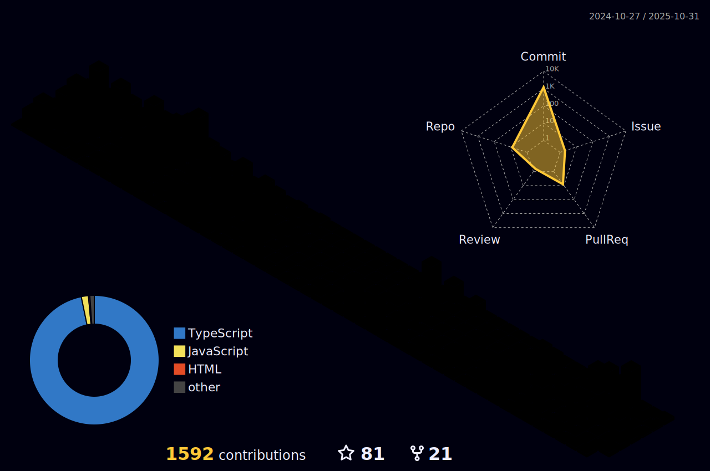

 

    <h1 align="center">✩&emsp;dulapahv&emsp;✩</h1>

    

 

 <h3>Third-year BSc Honours degree in Software Engineering student at the University of Glasgow</h3>
 <h3>Interested in front-end development and pursuing a career as a full-stack developer</h3>
 <h3>Experienced in developing websites using React.js, Next.js, Tailwind CSS, TypeScript, and Figma</h3>
 <h3>I look forward to where my career will take me.</h3>

 

<h3 align="center">Portfolio and Contacts

### 

### 

 
 
 
 
 
 

 

### 

  
  

 

### 

 
 
 
 
 

 

    

With :heart: from dulapahv :octocat:

